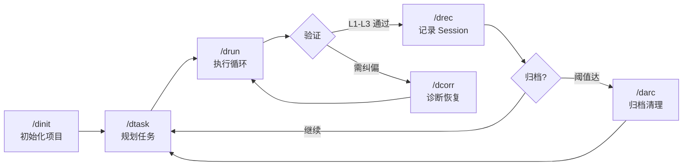
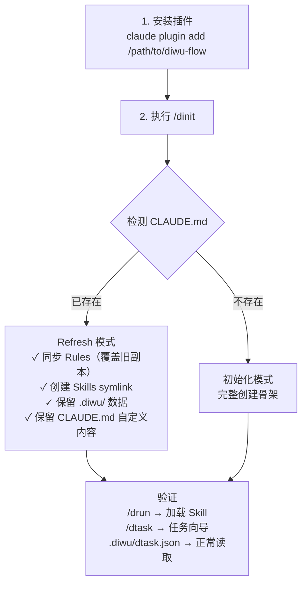

# diwu-flow

多平台方法论体系——Skills 为底，Commands 为壳。

## 架构

```mermaid
graph TB
    subgraph UI["用户交互层 — Commands"]
        C1["/drun"]
        C2["/dtask"]
        C3["/dinit"]
        C4["/dprd"]
        C5["/dadr"]
        C6["/ddoc"]
        C7["/ddemo"]
        C8["/dcorr"]
        C9["/dstat"]
        C10["/dloop"]
        C11["/dend"]
    end

    subgraph CORE["方法论层 — Skills（唯一真相源）"]
        S1["drun<br/>单任务执行"]
        S2["dtask<br/>任务管理"]
        S3["dvfy<br/>验证证据"]
        S4["djug<br/>判断锚点"]
        S5["dcorr<br/>纠偏恢复"]
        S6["dprd<br/>需求分析"]
        S7["drec<br/>记录写入"]
        S8["darc<br/>归档管理"]
        S9["ddoc<br/>文档生成"]
        S10["ddemo<br/>Demo 验证"]
    end

    subgraph AGENTS["执行层 — Agents"]
        A1["explorer<br/>只读探索"]
        A2["implementer<br/>代码实施"]
        A3["verifier<br/>独立验证"]
    end

    subgraph CC["平台增强层（CC 专属）"]
        H1["hooks/<br/>8 个事件"]
        H2["plugin.json"]
        H3["assets/"]
    end

    UI -->|薄封装| CORE
    CORE -->|调用| AGENTS
    CC -->|注入| UI
    CC -->|注入| AGENTS
```



## 核心原则

- **Skills 为底**：所有方法论内容在 Skills 中，任何平台可直接调用
- **Commands 为壳**：薄封装层，仅在有 Command 机制的平台提供增强交互
- **零平台耦合**：Skill frontmatter 无平台专属字段，可在任何工具中加载

## 工作流



## 快速开始

### Claude Code（推荐）

本项目即标准 CC 插件。安装后 **12 Skill**、3 核心执行 Agent、**11 Command** 自动可用。

### Codex CLI / OpenCode / 全平台

```bash
./install.sh --platform codex     # Codex: symlink 到 ~/.codex/
./install.sh --platform opencode   # OpenCode: Plugin + symlink
./install.sh --platform all        # 全部安装
```

## 配置（dsettings）

运行时配置文件：`.diwu/dsettings.json`。修改后立即生效。完整说明见 [`.diwu/dsettings-guide.md`](.diwu/dsettings-guide.md)。

| 配置项 | 默认值 | 说明 |
|--------|--------|------|
| `continuous_mode` | `true` | 任务完成后是否自动续跑下一个 |
| `review_limit` | `5` | 最大超前实施任务数 |
| `context_monitor_critical` | `50` | 写工具调用达此值自动存 checkpoint |
| `drift_detection.enabled` | `true` | 退化信号检测（走神/死循环/越界编辑） |
| `error_tracking.enabled` | `true` | 3-Strike 重试机制（工具连续失败时分级处理） |
| `error_injection.enabled` | `true` | 跨 session 错误模式学习（历史踩坑注入预防提示） |
| `subagent_concurrency` | `3` | 并行子代理最大数量 |

> **常用调整**：不想自动续跑 → `"continuous_mode": false`

## 资产总览

```mermindmap
  root((diwu-flow v0.0.5))
    Skills (11)
      drun 执行引擎
      dtask 任务管理
      dvfy 验证证据
      djug 判断锚点
      dcorr 纠偏恢复
      dprd 需求分析
      drec 记录写入
      darc 归档管理
      ddoc 文档生成
      ddemo Demo验证
      dstat 状态快照
    Agents (3 执行层)
      explorer 只读探索 | implementer 代码实施 | verifier 独立验收
      注：使用默认路径自动发现，不在 plugin.json 中声明
    Commands (11)
      /drun /dtask /dinit
      /dprd /dadr /ddoc
      /ddemo /dcorr /dstat
    Hooks (8事件)
      TaskCompleted / TaskCreated
      PreToolUse(Bash) ×2
      Stop(含archive检查)
      PreCompact / SessionStart
```

## 兼容性

| 能力 | Claude Code | Codex CLI | OpenCode |
|------|------------|-----------|----------|
| 11 Skills | plugin.json 声明 | symlink | symlink + Plugin |
| 3 Agents | 默认路径自动发现 | symlink | symlink |
| 9 Commands | Slash Commands | ❌ | 声明式索引 |
| Hooks | 8 事件 | ❌ | v1 不移植 |

## 从 diwu-workflow 迁移到 diwu-flow

> 以 Curio 为例：项目已有 `.diwu/` 运行时数据和 `.claude/rules/` 规则副本。

### 当前状态

```
Curio/
├── .claude/
│   ├── CLAUDE.md          ← 项目级指令（保留不动）
│   └── rules/             ← diwu-workflow 旧副本（待刷新）
├── .diwu/
│   ├── dtask.json         ← 任务数据（保留不动）
│   ├── recording/          ← Session 记录（保留不动）
│   └── archive/            ← 归档（保留不动）
└── ...（业务代码）
```

### 两步迁移



> 完整 Refresh Protocol 详见 [commands/dinit.md](commands/dinit.md)

### Rules 同步注意事项

`/dinit` 按 `rules-manifest.json` 清单对比 `.claude/rules/`：

| 文件状态 | 行为 |
|---------|------|
| 在清单中，内容一致 | 跳过 |
| 在清单中，内容不同 | **覆盖为插件最新版** |
| **不在**清单中 | **删除**（含自定义规则） |

有自定义规则？先备份：

```bash
cp -r .claude/rules/ /tmp/my-project-rules-backup/
# 然后执行 /dinit
```

## 双仓库防混淆

```bash
alias df='cd /path/to/diwu-flow'       # 插件仓库
alias dw='cd /path/to/diwu-workflow'   # 旧仓库（归档参考）

# 动手前确认：
pwd           # 当前目录？
git remote -v # 哪个 remote？
```

## 版本

v0.0.5 — /dloop 连续循环拆分 + stop_decision 双模式重构 + drun 纯单任务化。
详见 [CHANGELOG.md](CHANGELOG.md)。

## License

MIT
