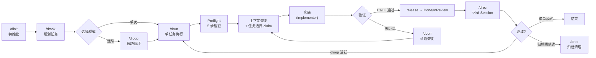
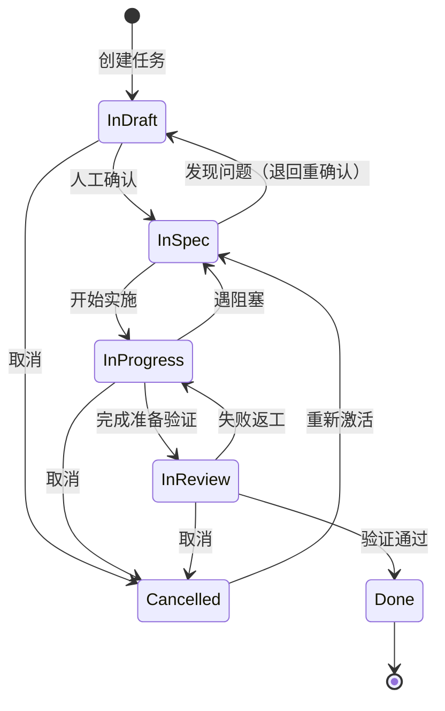
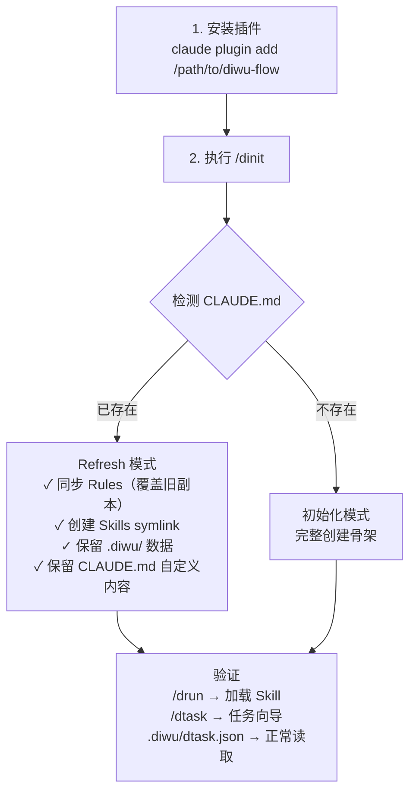

# diwu-flow

[](https://github.com/ssdiwu/diwu-flow)
[](LICENSE)
[](https://github.com/ssdiwu/diwu-flow)

多平台 AI 辅助开发方法论体系——**Skills 为底，Commands 为壳**。覆盖任务管理、验证证据、判断锚点、纠偏恢复、需求分析、需求细化、归档聚合等 **10 个核心 Skill**。（v0.0.10）

---

## 架构总览

```mermaid
flowchart LR
    subgraph UI["Commands 薄壳层（12）"]
        C1["/drun"] & C2["/dtask"] & C3["/dinit"]
        C4["/dprd"] & C5["/dadr"] & C6["/ddoc"]
        C7["/drec"] & C8["/dref"] & C9["/dcorr"]
        C10["/dstat"] & C11["/dloop"] & C12["/dend"]
    end

    subgraph CORE["Skills 方法论层（10）"]
        S1["drun"] & S2["dtask"] & S3["dvfy"]
        S4["dcorr"] & S5["dprd"]
        S6["drec"] & S7["ddoc"] & S8["dref"]
        S9["dstat"] & S10["dloop"]
    end

    subgraph AGENTS["Agents 执行层（3）"]
        A1["explorer"] & A2["implementer"] & A3["verifier"]
    end

    UI -->|"薄封装"| CORE
    CORE -->|"派发"| AGENTS
```



### 核心原则

| 原则 | 含义 |
|------|------|
| **Skills 为底** | 所有方法论内容在 Skills 中，任何平台可直接调用 |
| **Commands 为壳** | 薄封装层，仅在有 Command 机制的平台提供增强交互 |
| **零平台耦合** | Skill frontmatter 无平台专属字段，可在任何工具中加载 |

---

## 快速开始

### 新项目

```bash
# 1. 安装插件
claude plugin add /path/to/diwu-flow

# 2. 初始化项目骨架
/dinit

# 3. 规划第一个功能
/dtask "实现用户登录功能"

# 4. 开始执行
/drun                    # 单任务执行
# 或
/dloop --max-tasks 5     # 连续执行多个任务

# 5. 查看状态
/dstat                   # 项目全局状态快照
```

> 示例：做「消息通知」功能 → `/dprd` 讨论推送方式 → 确定用 WebSocket 时 `/dadr` 记录决策 → `/ddoc` 写产品文档 → `/dref` 细化关键需求 → `/dtask` 拆集成任务 → `/dloop` 开始循环。

### 接手老项目

```bash
# 1. 安装/更新插件
claude plugin add /path/to/diwu-flow

# 2. 刷新规则（不破坏 .diwu/ 数据）
/dinit refresh

# 3. 查看当前状态
/dstat

# 4. 继续上次的工作（自动恢复 InProgress 任务）
/drun
```

### 安装说明

| 平台 | 命令 | 产物 |
|------|------|------|
| Claude Code | `claude plugin add <path>` | 10 Skill + 3 Agent + 12 Command + 7 Hook |
| Codex CLI | `./install.sh --platform codex` | Skills + Agents symlink 到 `~/.codex/` |
| OpenCode | `./install.sh --platform opencode` | Plugin + symlink 到 `.opencode/` |
| 全部 | `./install.sh --platform all` | 以上全部 |

---

## 资产总览

### Skills（10 个）

| Skill | 类型 | 一句话定位 | 核心产出 |
|-------|------|-----------|---------|
| **drun** | rule | 单任务执行器 | Preflight 5 步 → 实施 → 验证 → 记录 |
| **dtask** | rule | 任务管理核心 | GWT 验收、task.json、规划分解 |
| **dvfy** | rule | 验证证据优先级 | L1-L5 五级证据、Done 判定矩阵 |
| **dcorr** | rule | 纠偏与误判排查 | 退化信号检测、四行重写模板 |
| **dprd** | product | 产品需求分析 | PRD 文档（产品级/完整版两种模式） |
| **drec** | rule | Session 记录与归档 | 格式模板、踩坑经验四段式记录、归档聚合指引 |
| **ddoc** | rule | 产品文档工具 | 正向(需求→文档) / 逆向(代码→文档) |
| **dref** | tool | 需求细化清单 | 洞察性反问→可执行检查清单 |
| **dstat** | tool | 项目状态只读聚合 | 任务进度 / Session / 决策 / Git 状态 |
| **dloop** | rule | drun 薄壳循环包装 | `while(未停止){ /drun }` |

### Commands（12 个）

| Command | 对应 Skill | 一句话 |
|---------|-----------|--------|
| `/drun` | drun | 执行单任务全链路 |
| `/dtask` | dtask | 规划 / 分解任务列表 |
| `/dinit` | — | 初始化或刷新项目骨架 |
| `/dprd` | dprd | 生成产品需求文档（PRD） |
| `/dadr` | — | 记录架构决策（ADR） |
| `/ddoc` | ddoc | 正向 / 逆向生成文档 |
| `/drec` | drec | Session 记录写入与归档 |
| `/dref` | dref | 需求细化清单 |
| `/dcorr` | dcorr | 纠偏恢复协议 |
| `/dstat` | dstat | 项目状态快照 |
| `/dloop` | dloop | 启动连续循环 |
| `/dend` | dloop | 取消连续循环 |

> 每个命令的约束表说明「必须同时为真的约束集合」——违反任一约束，输出即不可信。

### Agents（3 个）

| Agent | 定位 | 核心约束 |
|-------|------|---------|
| **explorer** | 只读探索 | 不修改任何文件；保护主对话上下文不被污染 |
| **implementer** | 代码实施 | 先读后写；JSON indent=2；唯一写权限角色 |
| **verifier** | 独立验收 | 不允许 Edit/Write；不读 recording/；不信任 implementer 自述 |

> 使用默认路径自动发现，不在 plugin.json 中声明。故障隔离：任何非核心 agent 失败时退化回 explorer→implementer→verifier 闭环。

### Hooks（7 事件 / 11 脚本）

| 事件 | 脚本 | 功能 |
|------|------|------|
| `TaskCompleted` | task_completed.py | 确认 recording 已写入 + decisions 已更新 |
| `TaskCreated` | task_created_validate.py | 新建任务校验 |
| `PreToolUse(Bash)` | drift_detect_pre.py + context_monitor.py | 退化信号检测 + 上下文监控（WARNING@30 / CRITICAL@50） |
| `PreToolUse(ExitPlanMode)` | plan_exit_hint.py | Plan→Dtask 门控提示 |
| `PreToolUse(Edit\|Write)` | task_entry_guard.py | 实施入口守卫 |
| `Stop` | stop_decision.py（内联 stop_archive.py） | 调度器：完整性检查 → 归档聚合 → continuous_mode 决策 |
| `PreCompact` | pre_compact.py | 压缩前保存 checkpoint 到 recording/ |
| `SessionStart` | session_start.py | 写 session ID；注入环境变量；自动注入 project-pitfalls.md（跳过纯模板+长度裁剪） |

---

## 工作流核心

### Session 生命周期



### drun vs dloop

| 维度 | /drun | /dloop |
|------|-------|--------|
| 定位 | 单任务执行器 | 多任务连续循环包装 |
| 停止条件 | 本任务完成即停 | max_tasks / 无可执行 / PENDING REVIEW / /dend |
| 元数据 | task_sessions（owner） | dloop（session_id + completed_ids） |
| 关系 | dloop 每轮调用一次完整 drun | drun 不知道 dloop 存在 |

### 运行时真相源

| 文件 | 职责 | 唯一写入方 |
|------|------|-----------|
| `.diwu/dtask.json` | 任务定义与 status 真相源 | dtask_transition.py |
| `.diwu/dtask-state.json` | runtime owner / dloop 元数据真相源 | dloop.py / dtask_transition.py |
| `scripts/dtask_transition.py` | 显式状态迁移的唯一入口 | （自身） |

> `InSpec → InProgress → InReview/Done/...` 的显式迁移应通过 `dtask_transition.py` 执行，禁止手改两个文件。

---

## 任务状态机



| 状态 | 含义 | 操作权限 |
|------|------|---------|
| `InDraft` | 需求草稿中，所有字段可自由修改 | 人工 + Agent |
| `InSpec` | 需求已确认锁定，仅可修改 `status` | 人工确认后由 Agent 推进 |
| `InProgress` | 实施中 | Agent |
| `InReview` | 实现完成，等待验证 | Agent 自审或人工确认 |
| `Done` | 验证通过（终态） | — |
| `Cancelled` | 已取消；可重新激活为 `InSpec` | 人工 |

**关键约束**：`InDraft` 任务 Agent 不会主动执行，必须由人工确认为 `InSpec` 后才开始实施。

`acceptance` 格式：功能/UI/修复类任务必须用 `Given … When … Then …`：

```
"Given 用户已登录 When 点击退出按钮 Then 清除 token 并跳转登录页"
```

> 完整状态转移规则见 `rules/task.md`。

---

## 命令参考

每个命令的约束表说明「必须同时为真的约束集合」——违反任一约束，输出即不可信。

### /drun — 单任务执行

| 维度 | 约束 |
|------|------|
| **业务边界** | 只做一件事：选任务 → claim → 实施 → 验证 → release。不做规划，不做批量 |
| **时序约束** | 必须先 claim(InProgress) 才能实施；必须通过 release 收尾(Done/InReview)。禁止手改 status |
| **跨命令关系** | 上游：/dtask（提供 InSpec 任务）；下游：/drec（记录结果）、/dcorr（纠偏时调用）；被 /dloop 包装 |
| **感知信号** | 恢复 InProgress(owner 匹配) / 选择下一个 InSpec / PENDING REVIEW(超前达上限) / invalid runtime state |

### /dtask — 任务管理

| 维度 | 约束 |
|------|------|
| **业务边界** | task ID 永不复用；functional/ui/bugfix 类 acceptance 必须 GWT 格式；steps 必须自包含（绝对路径） |
| **时序约束** | 先确定最大 ID → 澄清问题 → 生成 → 质量检查 → 可选三视角审查 → 写入 |
| **跨命令关系** | 输出是工作流引擎（hooks + Session 启动）的输入；blocked_by 引用的 ID 必须存在于 task.json 或 archive |
| **感知信号** | 质量检查发现问题必须列出具体问题 + 建议修正，不可静默写入 |

### /dinit — 初始化项目骨架

| 维度 | 约束 |
|------|------|
| **业务边界** | 已存在的文件不覆盖（幂等）；规则写入 `.claude/rules/`，不内联到 CLAUDE.md |
| **时序约束** | 收集信息 → 创建文件 → 验证清单；不可跳过信息收集直接创建文件 |
| **跨命令关系** | 创建的 `.diwu/dtask.json` 结构必须与 `/dtask` 写入格式兼容 |
| **感知信号** | 验证清单全部通过才算完成；缺少任一文件不算初始化成功 |

### /dprd — 产品需求文档

| 维度 | 约束 |
|------|------|
| **业务边界** | Layer 0 未通过时 Layer 1 不得开始；不写 task.json；不生成代码；Demo 需求名称必须 kebab-case |
| **时序约束** | 确认定位 → Q1-Q8 逐问（每次只问一个）→ 检查已有 PRD → 脊梁提炼（用户确认）→ 论证链设计（用户确认）→ 积木选取 → 反模式门禁 → 写入 → 自检 |
| **跨命令关系** | PRD README 的 Demo 需求列需手动验证或用 `/dprd` 重新评估生成落地方案；`.doc/README.md` 和 `.doc/adr/README.md` 是 Q5 的前置读取 |
| **感知信号** | 交付前自检：智能引号 0 命中、绝对路径 0 命中、乱码 0 命中 |

### /dadr — 架构决策记录

| 维度 | 约束 |
|------|------|
| **业务边界** | 同一决策只有一个 ADR（更新不新建）；Context 必须有具体数字；Consequences 的 ⚠️ 必须有触发条件和解决路径 |
| **时序约束** | 先读 README 判断新建/更新 → 写文件 → 更新 README；不可先写文件再判断 |
| **跨命令关系** | ADR README 是 `/dprd` Q5 的输入；ADR 编号格式 `ADR-NNN` 是 `/dtask` steps 引用的依据 |
| **感知信号** | 备选方案的缺点必须是具体技术风险和触发条件，不允许「复杂度高」等模糊描述 |

### /ddoc — 产品文档

| 维度 | 约束 |
|------|------|
| **业务边界** | 代码是锚点，无法确认的内容标注 `[待确认]`，不编造；逆向模式不写 task.json（大范围除外） |
| **时序约束** | 写文档 → 自审 → gap 分析（两层）→ 补充缺口 → 再次 gap 分析；gap 分析必须在自审之后 |
| **跨命令关系** | `.doc/README.md` 是所有命令的入口；每次写入文档后必须同步更新 README（通用货币维护义务） |
| **感知信号** | 有状态实体必须有 stateDiagram；核心业务流程必须有 flowchart；数据实体关系必须有 erDiagram |

### /dref — 需求细化

| 维度 | 约束 |
|------|------|
| **业务边界** | 对话式澄清，不自动写文件；产出是检查清单，确认后引导用 /dtask 转化为任务 |
| **时序约束** | 吸收分析 → 洞察性提问（每轮≤4问题）→ 迭代深挖或加速推进 → 输出最终清单 |
| **跨命令关系** | 上游：/dprd（depends）；下游：/dtask（清单→任务转化） |
| **感知信号** | 问题质量 > 数量；挑战假设优于泛泛之问；用户不耐烦时加速推进 |

### /dcorr — 纠偏恢复协议

| 维度 | 约束 |
|------|------|
| **业务边界** | 不改变 task.json 状态（纠偏是过程修正，不是状态转移）；不退化成全程运行总规范或禁止清单 |
| **时序约束** | 触发检测 → 停止 6 类动作 → 四行重写 → 误判排查（6 类泛化模式）→ 入口重判（A/B/C 三门控）→ 恢复执行骨架 → 结束前四问 |
| **跨命令关系** | 与 InProgress 任务共存时不改变状态，仅记录到 session 文件；恢复失败按止损序列处理（切上下文 → 缩任务 → 写缺口 → 请求人工） |
| **感知信号** | 恢复后第一条输出禁止宣称"已完成"；判断必须有依据（正例/反例/现象/数据）；验证优先级 L1-L3 主判，L5 不可宣称完成 |

**触发条件**（满足任一即启动）：

| # | 退化信号 |
|---|---------|
| 1 | 同一问题已被纠偏两次以上仍沿旧路径推进 |
| 2 | 同一前提被反复解释 |
| 3 | 输出越来越像通用套路，越来越不像当前任务 |
| 4 | 讨论越来越长，下一步动作越来越模糊 |
| 5 | 已改动却拿不出运行态或输出层证据 |
| 6 | 开始同时引用多个目录、多个入口、多个"真相源" |

### /dstat — 项目状态快照

| 维度 | 约束 |
|------|------|
| **业务边界** | 只读聚合，不修改任何状态或文件 |
| **时序约束** | 读取 dtask.json + dtask-state.json + recording/ + decisions.md + git status → 结构化输出 |
| **跨命令关系** | 可在任何时候独立调用；常用于接手项目后快速了解全貌 |
| **感知信号** | 缺少 .diwu/ 目录时提示需先 /dinit |

### /dloop — 连续循环

| 维度 | 约束 |
|------|------|
| **业务边界** | drun 的薄壳循环包装；自身不含任何执行逻辑，每轮委托 drun 完成 |
| **时序约束** | 初始化元数据 → while(未停止){ 调用 /drun } → 收尾汇总。停止条件：max_tasks 达标 / 无可执行任务 / PENDING REVIEW / /dend |
| **跨命令关系** | 上游：/dtask（提供任务池）；下游：/dend（外部停止）；依赖 /drun 作为执行引擎 |
| **感知信号** | continuous_mode=false 且无未提交变更且当前无 InProgress(owner 匹配) 时不续跑 |

### /dend — 取消连续循环

| 维度 | 约束 |
|------|------|
| **业务边界** | 仅设置 dloop 停止标志，不中断正在执行的 /drun |
| **时序约束** | 写入 dtask-state.json 的 dloop.stop=true → 当前 drun 完成本轮后不再续跑 |
| **跨命令关系** | /dloop 的配套停止命令 |
| **感知信号** | 无 dloop 活跃时提示无需操作 |

---

## 配置与调优

运行时配置文件：`.diwu/dsettings.json`。修改后立即生效。完整说明见 [`.diwu/dsettings-guide.md`](.diwu/dsettings-guide.md)。

| 配置项 | 默认值 | 说明 | 常用调整 |
|--------|--------|------|---------|
| `continuous_mode` | `true` | 任务完成后是否自动续跑 | 批量跑开 true，逐步验收改 false |
| `review_limit` | `5` | 最大超前实施任务数 | 团队验收快可调高 |
| `context_monitor_critical` | `50` | 写工具调用达此值自动存 checkpoint | 内存大的环境可调高 |
| `context_monitor_warning` | `30` | WARNING 阈值：工具调用次数 | — |
| `drift_detection.enabled` | `true` | 退化信号检测（走神/死循环/越界编辑） | 一般保持开启 |
| `error_tracking.enabled` | `true` | 3-Strike 重试机制（工具连续失败时分级处理） | 保持开启 |
| `error_injection.enabled` | `true` | 跨 session 错误模式学习（历史踩坑注入预防提示） | 保持开启 |
| `subagent_concurrency` | `3` | 并行子代理最大数量 | 算力充足可调高 |
| `task_archive_threshold` | `20` | Done/Cancelled 任务数触发归档 | 按项目规模调整 |
| `recording_archive_threshold` | `50` | session 文件数触发归档 | 长期项目可调高 |

---

## 异常处理

### BLOCKED — 环境或依赖问题

Agent 遇到以下情况停止任务并等待人工介入：缺少环境配置、外部依赖不可用、验证无法进行。

BLOCKED 时：任务退回 `InSpec`，禁止 commit，禁止标记 Done，记录阻塞原因到 `recording/`。

| 现象 | 正例(BLOCKED) | 反例(保持 InProgress) |
|------|--------------|---------------------|
| API 401 | 缺凭据，acceptance 要求真实响应 | 错误凭据 / Token 拼接错误 |
| 容器未运行 | 用户无权操作环境 | 配置文件有误（端口/路径/环境变量） |
| 测试超时 | 资源不足，其他环境可通过 | 死循环 / 死锁 / 未 mock |

### Change Request — 需求矛盾

`InSpec` 任务验收条件无法实现或存在矛盾时，Agent 提交 CR：保持 `InSpec`，输出原因+建议+影响评估，等待人工批准。

### 超前实施

前置任务 `InReview` 时可超前执行后续任务（最多 `review_limit` 个），完成后立即 commit。达上限后暂停验收并输出 PENDING REVIEW。

### 退化信号检测

由 `drift_detect_pre.py` 在每次 Bash 工具调用前自动检测：

| 检测类型 | 信号 |
|---------|------|
| edit_streak | 连续多次只编辑不验证 |
| pure_discussion | 多轮纯讨论无实质动作 |
| repetitive_loop | 同一错误模式反复出现 |
| scope_drift | 编辑范围偏离主线目录 |

---

## 多平台兼容性

| 能力 | Claude Code | Codex CLI | OpenCode |
|------|------------|-----------|----------|
| 10 Skills | plugin.json 声明 | symlink SKILL.md | symlink SKILL.md |
| 3 Agents | 默认路径自动发现 | symlink .md | symlink .md |
| 12 Commands | Slash Commands | 不支持 | 声明式索引(.md) |
| 7 Hook 事件 | hooks.json | 不支持 | v1 不移植 |
| Python 脚本 | CLAUDE_PLUGIN_ROOT | 不支持 | 不支持 |

---

## 从 diwu-workflow 迁移到 diwu-flow

> 以 Curio 为例：项目已有 `.diwu/` 运行时数据和 `.claude/rules/` 规则副本。

### 当前状态

```
Curio/
├── .claude/
│   ├── CLAUDE.md          ← 项目级指令（保留不动）
│   └── rules/             ← diwu-workflow 旧副本（待刷新）
├── .diwu/
│   ├── dtask.json         ← 任务数据（保留不动）
│   ├── recording/          ← Session 记录（保留不动）
│   └── archive/            ← 归档（保留不动）
└── ...（业务代码）
```

### 两步迁移



> 完整 Refresh Protocol 详见 [commands/dinit.md](commands/dinit.md)

### Rules 同步注意事项

`/dinit` 按 `rules-manifest.json` 清单对比 `.claude/rules/`：

| 文件状态 | 行为 |
|---------|------|
| 在清单中，内容一致 | 跳过 |
| 在清单中，内容不同 | **覆盖为插件最新版** |
| **不在**清单中 | **删除**（含自定义规则） |

有自定义规则？先备份：

```bash
cp -r .claude/rules/ /tmp/my-project-rules-backup/
# 然后执行 /dinit
```

---

## 设计理念

AI 擅长执行，不擅长决策。**人负责决策，AI 负责操作**。

基于四个规范驱动开发实践：

| 缩写 | 全称 | diwu-flow 对应 |
|------|------|---------------|
| **BDD** | Behavior-Driven Development | GWT 验收格式（Given/When/Then） |
| **TDD** | Test-Driven Development | dvfy L1-L5 证据优先级体系 |
| **SDD** | Specification-Driven Development | dtask.json 结构化任务定义 |
| **DDD** | Domain-Driven Design | dprd 领域驱动文档 + ddoc 分域文档 |

在此之上，用**强约束状态机**控制流转：

```
InDraft → InSpec → InProgress → InReview → Done
```

任意时刻只能处于一个明确的状态，只有满足特定条件才能转移。状态边界由规则定义，不依赖 AI 自我约束。

### 思维框架：现象→判断→动作

所有规则都是这条链的具体实例。违反此链的规则是空壳，缺少此链的工作是空转。

| 环节 | 含义 | 常见缺失 |
|------|------|---------|
| **现象** | 看到了什么（事实、数据、异常） | 抽象描述代替具体观察 |
| **判断** | 得出什么结论（依据什么） | 跳步到动作，或缺少依据 |
| **动作** | 接下来做什么（具体行动） | 停在理解层，不推动执行 |

### Agent 设计哲学（v0.0.4 核心收缩）

从**角色驱动**（10 个领域专家）转向**能力驱动**（3 个核心 primitive）。领域方法论内容归 skills/rules 层，agent 只负责执行。任何非核心 agent 失败时退化回 explorer→implementer→verifier 闭环。

### 不确定性门控

| 条件 | 路径 |
|------|------|
| 改动小 + 结果可预期 + 差异一句话说清 | **直接做** |
| 预期复杂 / 外部依赖 / 有契约约束 | **先写最小规格** |
| 第三方 API / 真实落点不清 / 回滚成本高 | **先探索验证** |

---

## 仓库结构

```
diwu-flow/
├── .claude-plugin/
│   ├── plugin.json              # 插件声明（10 Skill + 12 Command）
│   └── marketplace.json         # 发布市场元数据
├── skills/                      # 10 个方法论 Skill（唯一真相源）
│   └── {drun,dtask,dvfy,...}/SKILL.md
├── commands/                    # 12 个薄壳 Command（CC Slash Command）
│   └── {drun,dtask,dinit,...}.md
├── agents/                      # 3 个核心执行 Agent（默认路径自动发现）
│   ├── explorer.md              #   只读探索
│   ├── implementer.md           #   代码实施
│   └── verifier.md              #   独立验收
├── hooks/
│   ├── hooks.json               # 7 事件 / 11 脚本注册表
│   └── scripts/                 # Python hook 实现
├── scripts/                     # 共享脚本库（dinit/dloop/dstat/dtask_transition/...）
├── rules/                       # 12 个参考规则文件（渐进式披露，Read on demand）
├── assets/                      # /dinit 初始化模板资产
├── tests/                       # 三级测试（L1 配置 / L2 脚本 / L3 一致性）
├── install.sh                   # 多平台安装脚本
├── drelease.sh                  # 发布脚本（私有→公开仓库 worktree 隔离）
└── README.md                    # 本文件
```

---

## 双仓库防混淆

```bash
alias df='cd /path/to/diwu-flow'       # 插件仓库（本仓库）
alias dw='cd /path/to/diwu-workflow'   # 旧仓库（归档参考）

# 动手前确认：
pwd           # 当前目录？
git remote -v # 哪个 remote？
```

---

## Version

v0.0.7 — Agent 核心收缩至 3 个 + 新增 dstat/dloop/dend 三个 Command + 多平台架构重构。
详见 [CHANGELOG.md](CHANGELOG.md)。

## License

[MIT](LICENSE) © [ssdiwu](https://github.com/ssdiwu)
