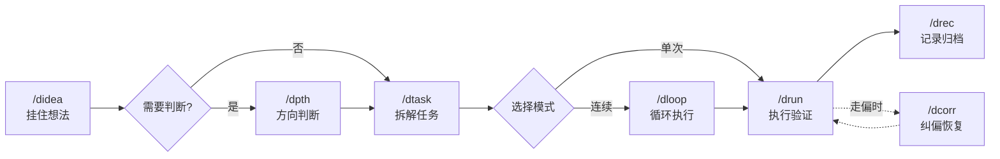

# diwu-flow

[](https://github.com/ssdiwu/diwu-flow)
[](LICENSE)
[](https://github.com/ssdiwu/diwu-flow)

利用 **11 个 Skill + 5 个 Agent + 13 个 Command + 状态机**，为 AI 编程代理提供完整开发方法论体系。让 AI 学会：**挂住想法 → 判断方向 → 拆解任务 → 执行验证 → 记录归档**，而不是漫无目的地写代码。（v0.1.0）

### v0.1.0 — 六层架构全局落地

五个 PR 协同完成了从入口到执行的完整链路：

- **L0 入口容器** — `/didea` 想法捕获，本地持久化，可选 GitHub issue 同步，下游衔接 dpth/dref/dprd/dtask
- **L1 判断收束** — `/dpth` 三模式产品判断，`/dref` 需求细化，`/dprd` 产品论证，`/ddoc` 产品文档
- **L2 下游扩展** — `architect` 技术审稿 gate，`debugger` 异常诊断优先
- **L3 协议层** — `rules/handoff.md` 定义主编排边界、回交模型、Handoff Report
- **L4 规则真相源** — 14 个 rules 文件重组，边界清晰，三副本同步
- **L5 表层能力** — `drun` 双入口、持久化四策略、`dloop` cron 驱动
- **横切增强** — `rules/testing.md` 测试分层策略

> 全量 409 tests passed。完整架构图与层间关系见 `.doc/架构规范.md`，完整变更见 CHANGELOG.md。

---

## 解决什么问题

每个用过 AI 辅助开发的人都遇到过这些：

| 你遇到了... | diwu-flow 提供 |
|------------|--------------|
| 聊天里冒出一个想法，聊完就丢了 | `/didea` — 想法捕获容器，本地持久化，需要时再调出来 |
| 老板/用户说"做个 XX"，不确定值不值得投入 | `/dpth` — 三模式产品判断（诊断/创始人/构建者），给出有立场的结论 |
| 知道做什么，但需求模糊，不知道怎么落地 | `/dref` — 四维判断 + 场景收敛 → 可执行检查清单 |
| 多个任务并行，状态混乱，忘记做到哪了 | `/dstat` — 一键查看任务进度 / Session / Git 状态 |
| AI 做着做着就走偏了，越改越乱 | `/dcorr` — 退化信号检测 + 四行重写模板，拉回正轨 |
| 做完了一堆事，但找不到当时怎么做的 | `/drec` — Session 记录 + 踩坑四段式 + 原子 commit |

### 完整工作流



> 核心链路：想法 → 判断 → 拆解 → 执行 → 记录。不需要产品决策环节可以跳到拆解直接执行。

---

## 快速开始

```bash
# 1. 安装（添加 marketplace + 安装插件）
claude plugin marketplace add ssdiwu/diwu-flow
claude plugin install diwu-flow@ssdiwu

# 2. 初始化项目骨架
/dinit

# 3. 开始干活（以下是人类说的话，agent 自动选择对应 skill 执行）
"我有一个想法，帮我挂住，后续再判断"     # → /didea
"帮我判断这个方向值不值得做"             # → /dpth
"把用户登录功能拆成任务"                 # → /dtask
"开始执行"                              # → /drun
"连续执行所有未完成任务"                 # → /dloop

# 4. 看看进度
/dstat
```

| 平台 | 安装命令 |
|------|---------|
| Claude Code | `claude plugin marketplace add ssdiwu/diwu-flow` + `claude plugin install diwu-flow@ssdiwu` |
| Codex CLI | `./install.sh --platform codex` |
| OpenCode | `./install.sh --platform opencode` |
| 卸载 | `./install.sh --uninstall [--dry-run]` |

---

## 能力全景

### Skills（11）— 方法论核心

所有方法论在 Skills 中。Commands 是薄封装，零平台耦合（Skill frontmatter 无 context/agent/model/hooks），任何工具链可独立加载。

| 分组 | Skill | Command | 做什么 |
|------|-------|---------|--------|
| 入口容器 | `didea` | `/didea` | 想法捕获——6 个动作（create/list/show/refine/archive/push），本地持久化，可选 GitHub issue 同步 |
| 判断收束 | `dpth` | `/dpth` | 产品思维——三模式判断（诊断/创始人/构建者），灵魂三问门控 |
| | `dref` | `/dref` | 需求细化——先判真伪 → 场景收敛 → 可执行检查清单 |
| | `dprd` | `/dprd` | 产品论证——门控 + JTBD/故事思维/MVP 减法按需取用 → PRD 文档 |
| | `ddoc` | `/ddoc` | 产品文档——正向（需求→文档）/ 逆向（代码→文档） |
| 任务闭环 | `dtask` | `/dtask` | 任务管理——GWT 验收 + 状态机 + blocked_by 依赖图 |
| | `drun` | `/drun` | 单任务执行器——Preflight 5 步 → 实施 → 验证 → 记录。支持双入口（dtask 来源 + direct request） |
| 连续执行 | `dloop` | `/dloop` `/dstop` | cron 驱动：定时触发 `/drun` 批量执行，适合无人值守 |
| 观察纠偏 | `dstat` | `/dstat` | 项目状态快照——任务进度 / Session / Git 一键查看 |
| | `dcorr` | `/dcorr` | 纠偏恢复——退化信号检测 + 五步纠偏协议 |
| | `drec` | `/drec` | Session 记录——踩坑四段式记录 + 原子 commit |

> `dstop` 和 `dinit` 为 command-only 特例（无对应 Skill）。完整列表见 `skills/README.md`。

### Agents（5）— 执行引擎

Agent 是 Skills 派发的执行单元，默认路径自动发现。故障时退化回 explorer→implementer→verifier 闭环。

| Agent | 触发条件 | 约束 |
|-------|---------|------|
| **explorer** | 首次接触代码库、追踪依赖、架构分析 | 只读，不修改文件 |
| **implementer** | 明确实现路径后的代码修改 | 先读后写，JSON indent=2 |
| **verifier** | 实施完成后独立验收 | 不信任 implementer 自述，从 acceptance 反推验证 |
| **architect** | ≥3 步任务 / API 变更 / 新增模块 | 不改代码，只审 dtask 定义域 |
| **debugger** | acceptance 不符 / 3-Strike 工具失败 / bug 排查 | 诊断后回交 implementer，不直接修 |

### Hooks（6 事件键 / 10 业务脚本）

所有 hook 经 `run_hook.py` 包装执行，区分 `strict`（阻断）和 `tolerant`（告警）。

| 事件 | 做什么 |
|------|--------|
| SessionStart | 写 scoped session ID + 注入项目踩坑经验 |
| TaskCreated | 校验 dtask.json 结构合法性 |
| PreToolUse | Bash: 漂移检测 + 上下文监控 / ExitPlanMode: Plan→Dtask 门控 / Edit\|Write: 实施入口守卫 |
| TaskCompleted | 清理 owner + dloop 追踪 |
| Stop | 续跑判定 + 归档检查 + recording 门控 |
| PreCompact | 压缩前自动存 checkpoint |

---

## 关键设计

### drun 双入口

`drun` 不仅执行 dtask 中的持久化任务，也接受用户直接描述的简单任务：

| 来源 | 触发 | 流程 | 收尾 |
|------|------|------|------|
| dtask | `/drun`（从 InSpec 任务池 claim） | 完整 Preflight → S1-S4 → closeout | release → Done/InReview + /drec |
| direct request | 用户直接描述 | 简化：快速判断 → 实施 → 验证 | /drec（命中 architect 条件时升级回 dtask） |

### 持久化四策略

| 策略 | 场景 |
|------|------|
| `none` — 纯对话收口 | 一次性问答 |
| `drec` — recording + commit | 简单任务常规收尾 |
| `dtask` — 纳入任务体系 | 复杂任务、跨 session 继续 |
| `dtask + drec` | 重要功能、长期追踪 |

### 任务状态机

```
InDraft → InSpec → InProgress → InReview → Done
                 ↑ 遇阻塞回退   ↑ 失败返工
```

InDraft 任务 Agent 不会执行。完整规则见 `rules/task.md`。

---

## 配置

运行时配置：`.diwu/dsettings.toml`，修改即生效。

| 配置项 | 默认 | 用途 |
|--------|------|------|
| `continuous_mode` | `true` | 完成后是否自动续跑下一个任务 |
| `dloop_review_cap` | `5` | 最大超前实施任务数 |
| `subagent_concurrency` | `3` | 并行子代理上限 |
| `drift_detection.enabled` | `true` | 退化信号检测（走神/死循环/越界编辑） |
| `error_tracking_enabled` | `true` | 3-Strike 工具失败重试 |
| `task_archive_limit` | `20` | Done/Cancelled 任务数触发归档 |
| `recording_file_limit` | `30` | session 文件数触发归档 |

完整说明见 `.diwu/dsettings-guide.md`。

---

## 设计理念

AI 擅长执行，不擅长决策。**人负责决策，AI 负责操作**。基于 BDD（GWT 验收）、TDD（L1-L5 证据体系）、SDD（结构化任务定义）和 DDD（分域文档），用强约束状态机控制流转——规则定义边界，不依赖 AI 自我约束。

核心思维框架是**现象→判断→动作**：看到事实 → 得出结论 → 执行行动。

---

## 仓库结构

```
diwu-flow/
├── skills/                 # 11 个方法论 Skill（唯一真相源）
├── commands/               # 13 个薄壳 Command
├── agents/                 # 5 个执行 Agent（默认路径自动发现）
├── hooks/
│   ├── hooks.json          # 6 事件 / 10 业务脚本 + 1 wrapper
│   └── scripts/            # Python hook 实现
├── scripts/                # 共享脚本库
├── rules/                  # 14 个运行规则（/dinit 同步到目标项目）
├── assets/dinit/           # /dinit 初始化模板
├── tests/                  # 三级测试（409 passed）
├── .doc/                   # 设计文档真相源
├── .claude-plugin/         # CC 插件声明
├── install.sh              # 多平台安装脚本
└── drelease.sh             # 公开版本发布脚本
```

---

## 多平台

| 能力 | Claude Code | Codex CLI | OpenCode |
|------|------------|-----------|----------|
| 11 Skills | plugin.json | symlink SKILL.md | symlink SKILL.md |
| 5 Agents | auto discover | symlink .md | symlink .md |
| 13 Commands | Slash Commands | — | 声明式索引 |
| 6 Hook 事件 | hooks.json | — | v1 不移植 |
| Python 脚本 | `CLAUDE_PLUGIN_ROOT` | — | — |

---

## Version

v0.1.0 — 六层架构全局落地：rules 真相源重构 → architect/debugger 接入 → dpth/dref/dprd 产品思维层 → didea 入口容器 → 说明层重写 + dloop cron 模式。全量 409 tests passed。详见 CHANGELOG.md。

## License

[MIT](LICENSE)

## 贡献者

| 贡献 | 贡献者 |
|------|--------|
| 核心架构 / 全部 Skills & Commands & Agents | [ssdiwu](https://github.com/ssdiwu) |
| dref Skill（需求细化清单方法论） | [RexYoung00](https://github.com/RexYoung00) |
