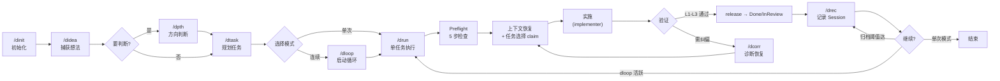
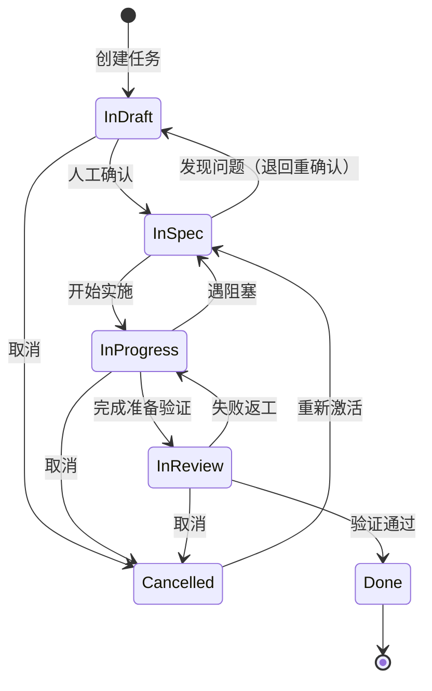
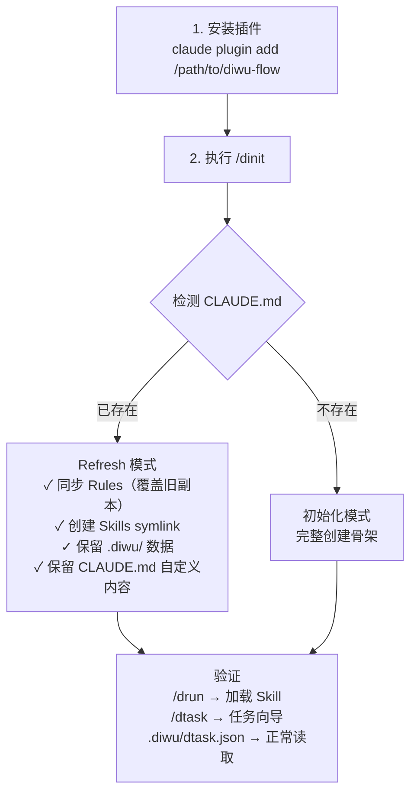

# diwu-flow

[](https://github.com/ssdiwu/diwu-flow)
[](LICENSE)
[](https://github.com/ssdiwu/diwu-flow)

多平台 AI 辅助开发方法论体系——**Skills 为底，Commands 为壳**。覆盖任务管理、判断锚点、纠偏恢复、需求分析、需求细化、归档聚合、想法捕获等 **11 个核心 Skill** + **5 个执行 Agent**。（v0.0.12）

---

## 架构总览

六层架构：**入口容器(L0) → 判断收束(L1) → 下游扩展(L2) → 协议(L3) → 规则真相源(L4) → 表层能力模型(L5)**

### Layer 1 — Commands 薄壳层（12）

用户直接调用的命令入口，每个 Command 是对应 Skill 的薄封装。

| 分组 | Commands | 定位 |
|------|----------|------|
| **入口/持久化** | `/didea` `/drec` | 想法捕获 / Session 归档 |
| **思考/收束** | `/dpth` `/dref` `/dprd` `/ddoc` | 产品判断 / 需求细化 / PRD / 文档 |
| **执行/控制** | `/drun` `/dloop` `/dstop` | 单任务 / 连续循环 / 停止循环 |
| **规划/辅助** | `/dtask` `/dinit` `/dcorr` `/dstat` | 任务管理 / 初始化 / 纠偏 / 状态快照 |

> `dstop` 和 `dinit` 是仅有的两个 command-only 特例（无对应 SKILL.md）。Commands 不含任何方法论逻辑，仅负责参数透传和交互增强。无 Command 机制的平台可直调 Skills。

### Layer 2 — Skills 方法论层（11）

所有方法论的唯一真相源，零平台耦合，可在任何工具链中独立加载。

| 分组 | Skills | 核心产出 |
|------|--------|---------|
| **入口容器** | `didea` | 想法捕获与下游衔接 |
| **思考收束** | `dpth` `dref` `dprd` `ddoc` | 产品方向判断 / 需求细化 / PRD论证 / 产品文档 |
| **任务闭环** | `dtask` `drun` | 任务定义 → 执行 → 验证 → 记录 |
| **连续执行** | `dloop` | drun 薄壳循环包装 |
| **观察纠偏** | `dstat` `dcorr` | 项目状态快照 / 纠偏恢复 |

> 注：Skill frontmatter 无平台专属字段（无 context/agent/model/hooks），是跨平台复用的基础。

### Layer 3 — Agents 执行层（5）

Skills 派发的执行单元，默认路径自动发现，故障时退化回三件套闭环。

| Agent | 定位 | 核心约束 |
|-------|------|---------|
| **explorer** | 只读探索 | 不修改文件；保护主对话上下文不被污染 |
| **implementer** | 代码实施 | 先读后写；JSON indent=2；唯一写权限角色 |
| **verifier** | 独立验收 | 不允许 Edit/Write；不信任 implementer 自述 |
| **architect** | 技术审稿 | 不改代码；只审 dtask 定义域 |
| **debugger** | 异常调查 | 不直接修代码；诊断后回交修复链 |

> 故障隔离：任何非核心 agent 失败时退化回 explorer→implementer→verifier 闭环。

### 层间关系与原则

```
用户 → Commands(薄封装, 12) → Skills(方法论, 11) → Agents(执行, 5)
         ↑ 仅 CC 平台        ↑ 所有平台通用     ↑ 默认路径自动发现
```

| 原则 | 含义 |
|------|------|
| **Skills 为底** | 所有方法论内容在 Skills 中，任何平台可直接调用 |
| **Commands 为壳** | 薄封装层，仅在有 Command 机制的平台提供增强交互 |
| **零平台耦合** | Skill frontmatter 无平台专属字段，可在任何工具中加载 |

---

## 快速开始

### 新项目

```bash
# 1. 安装插件
claude plugin add /path/to/diwu-flow

# 2. 初始化项目骨架
/dinit

# 3. 有想法？先挂住
/didea create --title "我的想法"

# 4. 要做产品判断？
/dpth                    # 方向判断
# 或 /dref               # 需求细化
# 或 /dprd               # 写 PRD

# 5. 规划第一个功能
/dtask "实现用户登录功能"

# 6. 开始执行
/drun                    # 单任务执行
# 或
/dloop --max-tasks 5     # 连续执行多个任务

# 7. 查看状态
/dstat                   # 项目全局状态快照
```

> 示例流程：有新方向 → `/didea` 挂住 → `/dpth` 判断值不值得做 → `/dref` 细化关键需求 → `/dtask` 拆集成任务 → `/dloop` 开始循环。

### 接手老项目

```bash
# 1. 安装/更新插件
claude plugin add /path/to/diwu-flow

# 2. 刷新规则（不破坏 .diwu/ 数据）
/dinit refresh

# 3. 查看当前状态
/dstat

# 4. 继续上次的工作（自动恢复 InProgress 任务）
/drun
```

### 安装说明

| 平台 | 命令 | 产物 |
|------|------|------|
| Claude Code | `claude plugin add <path>` | 11 Skill + 5 Agent + 12 Command + 6 Hook 事件 / 10 业务脚本 + 1 wrapper |
| Codex CLI | `./install.sh --platform codex` | Skills + Agents symlink 到 `~/.codex/` |
| OpenCode | `./install.sh --platform opencode` | Plugin + symlink to `.opencode/` |
| 卸载 | `./install.sh --uninstall [--dry-run]` | 清理 symlink（dry-run 仅预览不删除） |
| 全部 | `./install.sh --platform all` | 以上全部 |

---

## 资产总览

### Skills（11 个）

| Skill | 类型 | 一句话定位 | 核心产出 |
|-------|------|-----------|---------|
| **didea** | tool | 想法捕获容器 | 挂住灵感并连接下游 dpth/dref/dprd/dtask |
| **dpth** | product | 产品思维协作 | 三模式判断（诊断/创始人/构建器）+ 有立场结论 |
| **dref** | tool | 需求细化清单 | 问题发现 + 场景收敛 → 可执行检查清单 |
| **dprd** | product | 产品需求分析 | 灵魂三问门控 + 框架内化 → PRD 文档 |
| **ddoc** | rule | 产品文档工具 | 正向(需求→文档) / 逆向(代码→文档) / ADR |
| **drun** | rule | 单任务执行器 | Preflight 5 步 → 实施 → 验证 → 记录 |
| **dtask** | rule | 任务管理核心 | GWT 验收、task.json、规划分解 |
| **dcorr** | rule | 纠偏与误判排查 | 退化信号检测、四行重写模板 |
| **drec** | rule | Session 记录与归档 | 格式模板、踩坑经验四段式记录、原子 commit |
| **dstat** | tool | 项目状态只读聚合 | 任务进度 / Session / 决策 / Git 状态 |
| **dloop** | rule | drun 薄壳循环包装 | `while(未停止){ /drun }` |

### Commands（12 个）

| Command | 对应 Skill | 一句话 |
|---------|-----------|--------|
| `/didea` | didea | 想法捕获容器 |
| `/dpth` | dpth | 产品思维协作 |
| `/dref` | dref | 需求细化清单 |
| `/dprd` | dprd | 产品需求文档 |
| `/ddoc` | ddoc | 正向 / 逆向生成文档 |
| `/drec` | drec | Session 记录写入与归档 |
| `/dtask` | dtask | 规划 / 分解任务列表 |
| `/drun` | drun | 执行单任务全链路 |
| `/dinit` | — | 初始化或刷新项目骨架 |
| `/dcorr` | dcorr | 纠偏恢复协议 |
| `/dstat` | dstat | 项目状态快照 |
| `/dloop` | dloop | 启动连续循环 |
| `/dstop` | dloop | 停止连续循环 |

> 每个命令的约束表说明「必须同时为真的约束集合」——违反任一约束，输出即不可信。

### Agents（5 个）

| Agent | 定位 | 核心约束 |
|-------|------|---------|
| **explorer** | 只读探索 | 不修改任何文件；保护主对话上下文不被污染 |
| **implementer** | 代码实施 | 先读后写；JSON indent=2；唯一写权限角色 |
| **verifier** | 独立验收 | 不允许 Edit/Write；不信任 implementer 自述 |
| **architect** | 技术审稿 | 不改代码；只审 dtask 定义域 |
| **debugger** | 异常调查 | 不直接修代码；诊断后回交修复链 |

> 使用默认路径自动发现，不在 plugin.json 中声明。故障隔离：任何非核心 agent 失败时退化回 explorer→implementer→verifier 闭环。

### Hooks（6 事件 / 10 业务脚本 + 1 wrapper）

所有 hook 命令经 `run_hook.py` 包装执行，输出统一带 `[事件/脚本名]` 前缀；stderr 会追加到 `.diwu/logs/hooks.log`，不再使用 `2>/dev/null` 全吞。

| 事件 | 脚本 | 行为 | 失败处理 |
|------|------|------|----------|
| `SessionStart` | session_start.py | 写 scoped session ID + 注入 pitfalls | tolerant |
| `TaskCreated` | task_created_validate.py | 校验 dtask.json 合法性 | strict |
| `PreToolUse(Bash)` | drift_detect_pre.py + context_monitor.py | 漂移检测 + 上下文监控 | tolerant |
| `PreToolUse(ExitPlanMode)` | plan_exit_hint.py | Plan→Dtask 门控提示 | tolerant |
| `PreToolUse(Edit\|Write)` | task_entry_guard.py | 实施入口守卫 | strict |
| `TaskCompleted` | task_completed.py | 清 owner + dloop 追踪 | strict |
| `Stop` | stop_decision.py（内联 stop_archive.py） | 续跑判定 / 归档检查 / recording 门控 | strict |
| `PreCompact` | pre_compact.py | 压缩前保存 checkpoint | tolerant |

---

## 工作流核心

### Session 生命周期



### drun dual-entry 模型

| 维度 | dtask 来源 | direct request 来源 |
|------|-----------|-------------------|
| **触发方式** | `/drun`（从 InSpec 任务池选取） | 用户直接描述任务给 `/drun` |
| **前置条件** | Task 必须是 InSpec 且已 claim | 改动小 + 结果可预期 |
| **执行流程** | 完整 Preflight → S1-S4 → closeout | 简化流程：快速判断 → 实施 → 验证 |
| **收尾方式** | release → Done/InReview + /drec | /drec（或升级到 dtask 路径） |
| **升级条件** | — | 命中 architect 条件时必须升级回 dtask |

### Persistence Policy（持久化策略）

| 策略 | 含义 | 典型场景 |
|------|------|---------|
| `none` | 纯对话收口 | 一次性问答、简单确认 |
| `drec` | 只写 recording + commit | direct run 常规收尾 |
| `dtask` | 纳入任务体系 | 复杂任务、跨 session 继续 |
| `dtask+drec` | 最完整持久化 | 重要功能 + 需要长期追踪 |

### 运行时真相源

| 文件 | 职责 | 唯一写入方 |
|------|------|-----------|
| `.diwu/dtask.json` | 任务定义与 status 真相源 | dtask_transition.py |
| `.diwu/dtask-state.json` | runtime owner / dloop 元数据真相源 | dloop.py / dtask_transition.py |
| `scripts/dtask_transition.py` | 显式状态迁移的唯一入口 | （自身） |

> `InSpec → InProgress → InReview/Done/...` 的显式迁移应通过 `dtask_transition.py` 执行，禁止手改两个文件。

---

## 任务状态机



| 状态 | 含义 | 操作权限 |
|------|------|----------|
| `InDraft` | 需求草稿中，所有字段可自由修改 | 人工 + Agent |
| `InSpec` | 需求已确认锁定，仅可修改 `status` | 人工确认后由 Agent 推进 |
| `InProgress` | 实施中 | Agent |
| `InReview` | 实现完成，等待验证 | Agent 自审或人工确认 |
| `Done` | 验证通过（终态） | — |
| `Cancelled` | 已取消；可重新激活为 `InSpec` | 人工 |

**关键约束**：`InDraft` 任务 Agent 不会主动执行，必须由人工确认为 `InSpec` 后才开始实施。

`acceptance` 格式：功能/UI/修复类任务必须用 Given … When … Then …

> 完整状态转移规则见 `rules/task.md`。

---

## 配置与调优

运行时配置文件：`.diwu/dsettings.json`。修改后立即生效。完整说明见 [`.diwu/dsettings-guide.md`](.diwu/dsettings-guide.md)。

| 配置项 | 默认值 | 说明 | 常用调整 |
|--------|--------|------|---------|
| `continuous_mode` | `true` | 任务完成后是否自动续跑 | 批量跑开 true，逐步验收改 false |
| `review_limit` | `5` | 最大超前实施任务数 | 团队验收快可调高 |
| `context_monitor_critical` | `50` | 写工具调用达此值自动存 checkpoint | 内存大的环境可调高 |
| `context_monitor_warning` | `30` | WARNING 阈值：工具调用次数 | — |
| `drift_detection.enabled` | `true` | 退化信号检测（走神/死循环/越界编辑） | 一般保持开启 |
| `error_tracking.enabled` | `true` | 3-Strike 重试机制 | 保持开启 |
| `subagent_concurrency` | `3` | 并行子代理最大数量 | 算力充足可调高 |
| `task_archive_threshold` | `20` | Done/Cancelled 任务数触发归档 | 按项目规模调整 |
| `recording_archive_threshold` | `30` | session 文件数触发归档 | 长期项目可调高 |

---

## 设计理念

AI 擅长执行，不擅长决策。**人负责决策，AI 负责操作**。

基于四个规范驱动开发实践：

| 缩写 | 全称 | diwu-flow 对应 |
|------|------|---------------|
| **BDD** | Behavior-Driven Development | GWT 验收格式（Given/When/Then） |
| **TDD** | Test-Driven Development | L1-L5 证据优先级体系（见 rules/verification.md） |
| **SDD** | Specification-Driven Development | dtask.json 结构化任务定义 |
| **DDD** | Domain-Driven Design | dprd 领域驱动文档 + ddoc 分域文档 |

在此之上，用**强约束状态机**控制流转：

```
InDraft → InSpec → InProgress → InReview → Done
```

任意时刻只能处于一个明确的状态，只有满足特定条件才能转移。状态边界由规则定义，不依赖 AI 自我约束。

### 思维框架：现象→判断→动作

所有规则都是这条链的具体实例。违反此链的规则是空壳，缺少此链的工作是空转。

| 环节 | 含义 | 常见缺失 |
|------|------|---------|
| **现象** | 看到了什么（事实、数据、异常） | 抽象描述代替具体观察 |
| **判断** | 得出什么结论（依据什么） | 跳步到动作，或缺少依据 |
| **动作** | 接下来做什么（具体行动） | 停在理解层，不推动执行 |

---

## 仓库结构

```
diwu-flow/
├── .claude-plugin/
│   ├── plugin.json              # 插件声明（11 Skill + 12 Command）
│   └── marketplace.json         # 发布市场元数据
├── skills/                      # 11 个方法论 Skill（唯一真相源）
│   └── {name}/SKILL.md
├── commands/                    # 12 个薄壳 Command（CC Slash Command）
│   └── {name}.md
├── agents/                      # 5 个执行 Agent（默认路径自动发现）
│   ├── README.md                #   Agent 速查表
│   └── {name}.md
├── hooks/
│   ├── hooks.json               # 6 事件 / 10 业务脚本注册表
│   └── scripts/                 # Python hook 实现
├── scripts/                     # 共享脚本库（common.py/dtask_transition/session_scope/dloop/dstat/...）
├── rules/                       # 14 个参考规则文件（渐进式披露，Read on demand）
├── assets/                      # /dinit 初始化模板资产
├── tests/                       # 三级测试（L1 配置 / L2 脚本 / L3 一致性）
├── .doc/                        # 设计文档真相源
│   ├── 架构规范.md              # 能力架构 + 源码仓结构
│   ├── README.md                # 导航索引
│   ├── 状态文件规格.md
│   └── 工程规范.md
├── install.sh                   # 多平台安装脚本
├── drelease.sh                  # 发布脚本（私有→公开仓库 worktree 隔离）
└── README.md                    # 本文件
```

---

## 多平台兼容性

| 能力 | Claude Code | Codex CLI | OpenCode |
|------|------------|-----------|----------|
| 11 Skills | plugin.json 声明 | symlink SKILL.md | symlink SKILL.md |
| 5 Agents | 默认路径自动发现 | symlink .md | symlink .md |
| 12 Commands | Slash Commands | 不支持 | 声明式索引(.md) |
| 6 Hook 事件 / 10 业务脚本 + 1 wrapper | hooks.json | 不支持 | v1 不移植 |
| Python 脚本 | CLAUDE_PLUGIN_ROOT | 不支持 | 不支持 |

---

## 从 diwu-workflow 迁移到 diwu-flow

> 以 Curio 为例：项目已有 `.diwu/` 运行时数据和 `.claude/rules/` 规则副本。

### 两步迁移



> 完整 Refresh Protocol 详见 [commands/dinit.md](commands/dinit.md)

## Version

v0.0.12 — PR1-PR4 合并完成（rules 真相源重构 + architect/debugger 接入 + dpth/dref/dprd 增强 + didea 容器层）。详见 [CHANGELOG.md](CHANGELOG.md)。

## License

[MIT](LICENSE)

## 贡献者

| 贡献 | 贡献者 |
|------|--------|
| 核心架构 / 全部 Skills & Commands & Agents | [ssdiwu](https://github.com/ssdiwu) |
| dref Skill（需求细化清单方法论） | [RexYoung00](https://github.com/RexYoung00) |
