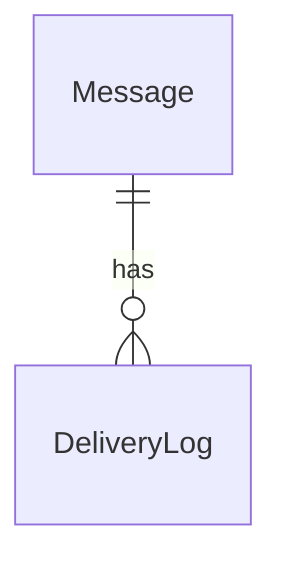
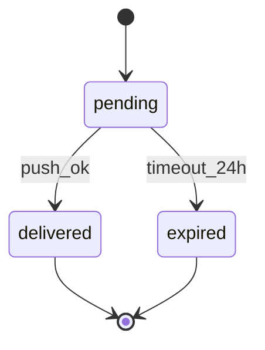
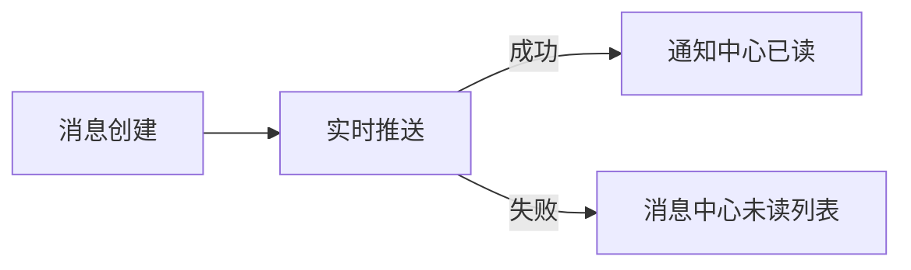

## 不可协商规则

1. **锚点铁律**（逆向模式）：每条描述必须可追溯到代码或可观测行为，禁止编造无法验证的内容
2. **标注铁律**（正向模式）：无法确认的内容必须标注 ` [待确认]` ，禁止用推测替代事实
3. **完整性铁律**：必须执行两层完整性检查——结构检查（有没有？）+ 深度检查（够不够？）
4. **边界铁律**：禁止将 API 文档生成（OpenAPI/Swagger）或代码注释任务（JSDoc/Docstring）当作 ddoc 使用场景
5. **格式铁律**：文档输出必须使用纯中文（行业术语除外），序号层级符合 `1.→1.1→1.1.1→•→。`
6. **写入安全**：输出到 `.doc/` 前必须先 Read 目标文件当前状态，防止覆盖已有内容
7. **类型路由优先**：必须先通过意图识别确定文档类型，再进入对应模板流程，不得跳过类型选择

---

# ddoc — 文档生成工具

产品文档工具。核心能力：**根据用户意图识别文档类型**，从 8 类标准文档类型中路由到对应模板与完整性标准。

> 完整类型定义见 `references/doc-types.md`

---

## 一、意图识别层

用户触发 ddoc 时，首先判断三个维度：

| 维度 | 问题 | 判定 |
|------|------|------|
| **方向** | 有代码还是有需求？ | 有代码 → 逆向提取；有需求/设计 → 正向生成 |
| **范围** | 整个产品 / 特定模块 / 单个功能？ | 决定扫描深度和输出粒度 |
| **目的** | 新建 / 重构 / 增量更新？ | 新建走完整流程；增量更新只查变更域 |

### 触发词 → 方向映射

| 触发词 | 方向 |
|--------|------|
| `reverse` / `逆向` / `还原文档` / `从代码` / `梳理架构` | 逆向 |
| `forward` / `正向` / `写文档` / `需求文档化` / `设计方案` | 正向 |

未匹配时询问：模式（正向/逆向）、范围（产品/模块/功能）、输入源（代码路径或需求描述）。

---

## 二、类型路由层

8 类文档类型是 ddoc 的输出模型核心。每种类型有独立的模板路径、关键要素和完整性标准。

### 路由决策树

```
用户说"写文档" → 意图识别（方向+范围+目的）
  ├─ 正向生成 → 进入 §三 类型选择
  └─ 逆向提取 → 进入 §三 类型选择
      （逆向也有类型：API契约/变更记录/运维手册 从代码中提取）
```

### 8 类文档速查表

| # | 类型 | 方向 | 典型场景 | 核心产出 | 详细定义 |
|---|------|------|---------|---------|---------|
| T1 | 产品需求（PRD） | 正向 | 新功能立项、需求文档化 | 用户故事 + 约束矩阵 + 验收场景 | 见 doc-types.md §T1 |
| T2 | 设计规范 | 正向 | 技术方案评审、架构决策记录 | 约束表 + 原子分解 + 边界定义 | 见 doc-types.md §T2 |
| T3 | 页面规格 | 正向 | UI 开发前对齐、设计稿转规格 | 组件树 + 交互状态 + 数据绑定 | 见 doc-types.md §T3 |
| T4 | 数据模型 | 双向 | 数据库设计、ORM 还原 | 实体 + 字段 + 关系 + 约束 | 见 doc-types.md §T4 |
| T5 | API 契约 | 逆向 | 接口文档补全、第三方对接 | 端点 + 入参出参 + 错误码 + 认证 | 见 doc-types.md §T5 |
| T6 | 变更记录 | 逆向 | 版本发布、changelog 生成 | 变更条目 + 影响范围 + 迁移指南 | 见 doc-types.md §T6 |
| T7 | 运维手册 | 逆向 | 部署文档、故障排查手册 | 拓扑 + 配置 + 操作 SOP + 告警 | 见 doc-types.md §T7 |
| T8 | 知识问答 | 双向 | FAQ、onboarding 文档、概念解释 | Q&A 对 + 概念索引 + 交叉引用 | 见 doc-types.md §T8 |

### 方向 × 类型矩阵

| | T1 PRD | T2 设计规范 | T3 页面规格 | T4 数据模型 | T5 API 契约 | T6 变更记录 | T7 运维手册 | T8 知识问答 |
|--|--------|-----------|-----------|-----------|------------|-----------|-----------|-----------|
| **正向生成** | 主路径 | 主路径 | 主路径 | 主路径 | 辅助(设计阶段) | — | — | 主路径 |
| **逆向提取** | — | — | — | 主路径 | 主路径 | 主路径 | 主路径 | 辅助(整理) |

---

## 三、高判别问题层

每个类型用 3-4 个关键问题确认选择是否正确。答"不知道"或"都不像"时考虑换类型。

### T1 产品需求（PRD）

- 这个文档的读者是**产品经理/开发者**还是**最终用户**？（前者 → PRD）
- 是否需要描述"为什么做"而不仅是"做什么"？（是 → PRD）
- 是否包含用户故事、验收场景、非功能需求？（是 → PRD）

### T2 设计规范

- 是否需要回答"技术上怎么做"而非"业务上做什么"？（是 → 设计规范）
- 是否涉及约束分析、原子分解、降级策略？（是 → 设计规范）
- 读者是否需要据此写出代码？（是 → 设计规范）

### T3 页面规格

- 是否聚焦于**单个页面/屏幕**的完整描述？（是 → 页面规格）
- 是否需要列出所有组件、状态、交互和数据绑定？（是 → 页面规格）
- 是否给前端开发人员作为实现依据？（是 → 页面规格）

### T4 数据模型

- 核心产出是否是**实体/表/字段定义**？（是 → 数据模型）
- 是否需要 ER 图和关系描述？（是 → 数据模型）
- 读者是否据此建库或写 ORM？（是 → 数据模型）

### T5 API 契约

- 核心产出是否是**端点列表 + 请求/响应格式**？（是 → API 契约）
- 是否需要给调用方（前端/第三方）作为对接依据？（是 → API 契约）
- 代码中是否有 route/controller/handler 层可提取？（逆向时）（是 → API 契约）

### T6 变更记录

- 是否按**版本/时间**组织变更条目？（是 → 变更记录）
- 是否需要描述"改了什么 + 影响谁 + 怎么迁移"？（是 → 变更记录）
- 是否从 git log / diff 中提取信息？（逆向时）（是 → 变更记录）

### T7 运维手册

- 读者是否是**运维人员/SRE**？（是 → 运维手册）
- 是否包含部署拓扑、配置项、故障排查 SOP？（是 → 运维手册）
- 是否从 docker-compose/Dockerfile/CI 配置中提取？（逆向时）（是 → 运维手册）

### T8 知识问答

- 格式是否以 **Q&A 对**为主？（是 → 知识问答）
- 目标是否是降低新人上手成本或解答高频问题？（是 → 知识问答）
- 是否需要概念索引和交叉引用？（是 → 知识问答）

---

## 四、红旗信号层

以下信号表明**选错了类型**或**不该继续**：

| 信号 | 含义 | 动作 |
|------|------|------|
| 读者不确定是谁 | 类型选择缺乏目标受众 | 先问清楚读者再选类型 |
| 同时声称"写给所有人" | 范围失控 | 拆分为多个类型各写一份 |
| 内容同时覆盖 5+ 个类型 | 单文档职责过载 | 按类型拆分文件 |
| 逆向模式下 `[待确认]` 超过 10% | 锚点不足或范围过大 | 缩小范围或标记 BLOCKED |
| 正向模式下需求只有一句话 | 输入不足以生成任何类型 | 退回需求收集（dref/dprd） |
| 只需要接口格式不需要业务语义 | 不是 ddoc 场景 | 用 OpenAPI/Swagger |
| 项目 < 500 行代码 | 不值得还原文档 | 直接读代码即可 |
| 文档没有后续维护者 | 写了也白写 | 确认维护者或降低投入 |

---

## 五、输出导向层

类型确定后，按对应路径获取模板和执行流程：

### 正向生成路径（T1-T4, T8）

- 从 `references/doc-types.md` 获取该类型的**关键要素清单**
- 从 `references/templates.md` 获取该类型的**输出模板**
- 从 `references/forward-mode.md` 获取**六步设计法**（约束发现 → 原子定义 → 组合设计 → 边界划定 → 降级策略 → 同步策略）
- 从 `references/completeness.md` 执行**两层完整性检查**

### 逆向提取路径（T4-T7, T8 辅助）

- 从 `references/doc-types.md` 获取该类型的**关键要素清单**
- 从 `references/reverse-mode.md` 获取**代码结构→文档映射表**和**跨语言识别模式**
- 从 `references/templates.md` 获取 **AI1/AI2 prompt 模板**
- 从 `references/completeness.md` 执行**两层完整性检查**

---

## 六、五约束维度（通用工具箱）

约束 = 不管系统怎么运行，恒成立的东西。适用于 T1/T2/T4 等需要深度分析的类型。

| 维度 | 检验问题 | 典型例子 |
|------|---------|---------|
| **业务约束** | 100 年后还成立吗？ | "已删除的记录不可恢复" |
| **时序约束** | 有没有执行路径可以绕过？ | "终态不可回退" |
| **跨端约束** | 两端不同是 bug 吗？ | "枚举值在所有端完全一致" |
| **并发约束** | 两个线程同时做会出问题吗？ | "状态机事件串行处理" |
| **感知约束** | 超过阈值用户会注意到吗？ | "操作响应 < 100ms" |

> 各维度详解和典型遗漏见 `references/forward-mode.md` §约束维度展开

---

## 最小输出示范（R1）——锚定输出粒度

以下示范以"消息通知域"为例，展示**当前五层结构**下的最小完整输出。AI 生成文档时必须达到此粒度（信息密度，非字数）。

````markdown
# 消息通知域（最小完整示范）

## 1. 数据层

### 实体
| 实体 | 字段 | 约束 |
|------|------|------|
| Message | id, user_id, content, status, created_at, expire_at | status ∈ {pending, delivered, expired}；id 全局唯一 |
| DeliveryLog | id, message_id, channel, delivered_at, result | message_id 外键；result ∈ {ok, fail} |



## 2. 接口层
| 端点 | 入参 | 出参 | 错误码 |
|------|------|------|-------|
| POST /api/messages | {userId, content} | {messageId, status} | 400 参数错误，503 DB 不可用 |
| GET /api/messages/unread | {userId} | [{id, content, createdAt}] | 401 未登录 |

## 3. 业务逻辑层
- 规则1：同一条消息只能成功投递一次（幂等）
- 规则2：pending 消息在用户下次登录 24h 内可重投，超时转 expired
- 异常：推送失败时记录 DeliveryLog(result=fail)，不标记 delivered



## 4. 产品层
### 角色与旅程
- 角色：已登录用户
- 主路径：收到新消息 -> 点击通知 -> 查看详情
- 失败路径：推送失败 -> 下次登录后消息中心可见未读消息



### 非功能约束
- 推送到达延迟 P95 < 500ms
- 未读列表查询 P95 < 200ms
`````

> **使用方式**：替换域名和实体后即可作为文档骨架。五层分别对应：数据结构 → API → 业务规则 → 用户视角 → 质量指标。不是所有文档都需要全部五层——按需裁剪。

---

## 输出结构选择（R2）

### 选择决策树

```
有 3 个以上明确业务域？
  ├─ 是 → 领域驱动结构
  └─ 否 → 业务域不明确？
      ├─ 是 → 分层结构
      └─ 否 → 项目规模小？
          ├─ 是 → 分层结构
          └─ 否 → 领域驱动结构
```

### 领域驱动结构（推荐）

适合：有 3 个以上明确业务域、AI 是主要读者、长期维护的项目。

```
.doc/
├── README.md          # 文件一览 + 任务→域文件映射表
├── constraints.md     # 全局约束（跨域共享）
├── [domain-a].md      # 域A：数据/接口/业务规则/状态机
├── [domain-b].md      # 域B：同上
└── setup.md           # 环境域：技术栈、依赖、本地配置
```

### 分层结构

适合：业务域不明确的工具类产品、文档读者主要是人、小项目。

```
.doc/
├── data.md            # 数据层：实体、字段、关系
├── api.md             # 接口层：端点、入参、出参、错误码
├── logic.md           # 逻辑层：规则、状态机、算法
└── product.md         # 产品层：角色、旅程、权限、非功能需求
```

> **选择参考**：有类型路由时优先用领域驱动；不确定时问读者偏好。

---

## 两层完整性检查（R4）

文档生成后必须执行两层检查：

### 结构检查（有没有？）

| # | 检查项 | 通过条件 |
|---|--------|---------|
| 1 | 所有声明的章节/模块都存在？ | 无空章节占位符 |
| 2 | 表格/图示/代码块都有内容？ | 无 `[待补充]` 占位超过 2 处 |
| 3 | 交叉引用可解析？ | 引用的文件/章节确实存在 |
| 4 | frontmatter / 元信息完整？ | 类型/范围/日期/作者齐全 |

### 深度检查（够不够？）

| # | 检查项 | 通过条件 |
|---|--------|---------|
| 1 | 核心流程有完整路径？ | 从输入到输出的全链路可走通 |
| 2 | 边界条件覆盖了？ | 正常/异常/降级各至少 1 例 |
| 3 | 非功能约束有量化？ | 不用"快"/"好"等模糊词 |
| 4 | 可观测行为可验证？ | 每个 claim 能对应到测试或操作步骤 |

> 不通过时标注缺口位置和修复建议，不直接阻断输出。

---

## 高频误用（R5）

| # | 误用 | 后果 | 正确做法 |
|---|------|------|---------|
| 1 | 把 API 文档当产品文档写 | 缺少业务上下文，读者不知道为什么这样设计 | 先识别文档类型再选模板 |
| 2 | 正向模式下从零开始编造需求 | 输出不可追溯，容易产生幻觉内容 | 必须基于代码或已有需求材料 |
| 3 | 逆向模式下不标注 `[待确认]` | 读者无法区分事实和推测 | 无法确认的内容必须显式标记 |
| 4 | 一份文档试图覆盖 8 类全部 | 职责过载，每类都浅尝辄止 | 按意图拆分为多份文档 |
| 5 | 项目 < 500 行还调用 ddoc | 投入产出比不合理 | 直接读代码即可 |

---

## References

| 文件 | 用途 |
|------|------|
| `references/doc-types.md` | 8 类文档类型完整定义、要素清单、示例片段 |
| `references/forward-mode.md` | 正向生成方法论：六步设计法、状态机/管道设计、变化速率原理 |
| `references/reverse-mode.md` | 逆向提取方法论：代码映射表、跨语言识别、逆向 Spec 技术 |
| `references/completeness.md` | 两层完整性检查：结构检查 + 深度检查 + AI 自审清单 |
| `references/templates.md` | 输出模板：AI prompt / 设计文档 / 反模式 |
