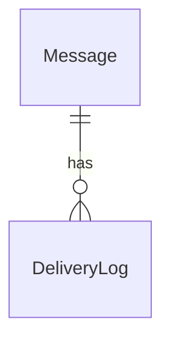
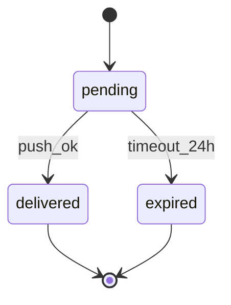
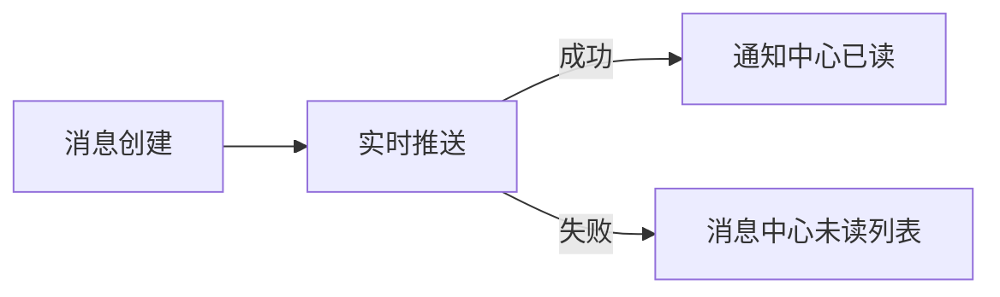

# 四层最小完整示范

> 从 ddoc SKILL.md §四层最小完整示范 抽取。锚定输出粒度（可直接参照）。

````markdown
# 消息通知域（最小完整示范）

## 1. 数据层

### 实体

| 实体 | 字段 | 约束 |
|------|------|------|
| Message | id, user_id, content, status, created_at, expire_at | status ∈ {pending, delivered, expired}；id 全局唯一 |
| DeliveryLog | id, message_id, channel, delivered_at, result | message_id 外键；result ∈ {ok, fail} |



## 2. 接口层

| 端点 | 入参 | 出参 | 错误码 |
|------|------|------|-------|
| `POST /api/messages` | `{userId, content}` | `{messageId, status}` | `400` 参数错误，`503` DB 不可用 |
| `GET /api/messages/unread` | `userId` | `[{id, content, createdAt}]` | `401` 未登录 |

## 3. 业务逻辑层

- 规则1：同一条消息只能成功投递一次（幂等）
- 规则2：`pending` 消息在用户下次登录 24h 内可重投，超时转 `expired`
- 异常：推送失败时记录 `DeliveryLog(result=fail)`，不标记 delivered



## 4. 产品层

### 角色与旅程
- 角色：已登录用户
- 主路径：收到新消息 -> 点击通知 -> 查看详情
- 失败路径：推送失败 -> 下次登录后消息中心可见未读消息



### 非功能约束
- 推送到达延迟 P95 < 500ms
- 未读列表查询 P95 < 200ms
```
